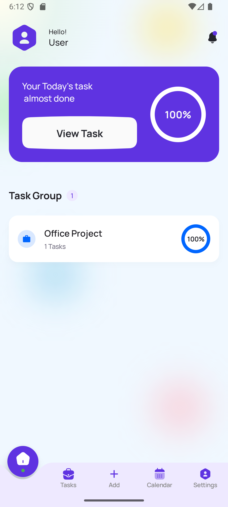
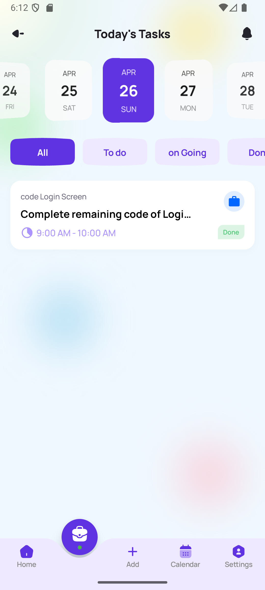
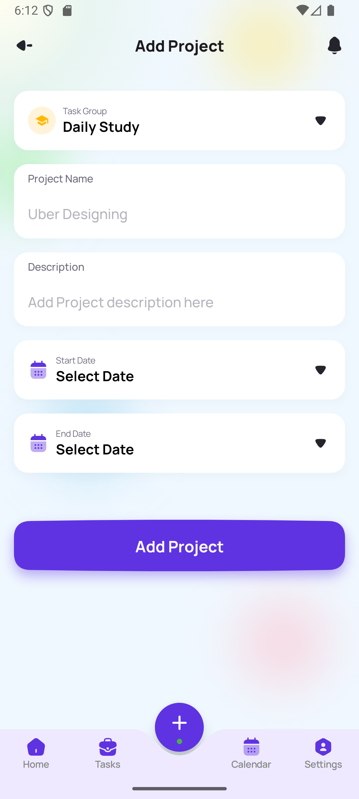
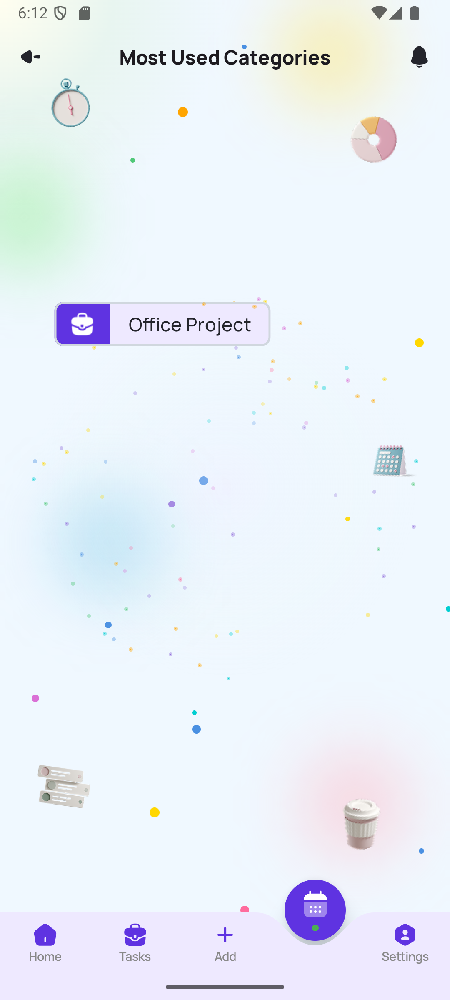
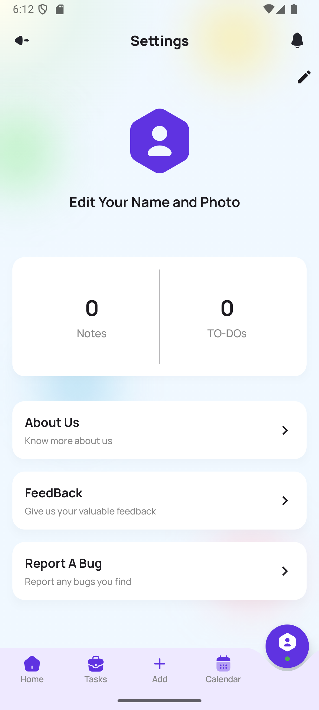
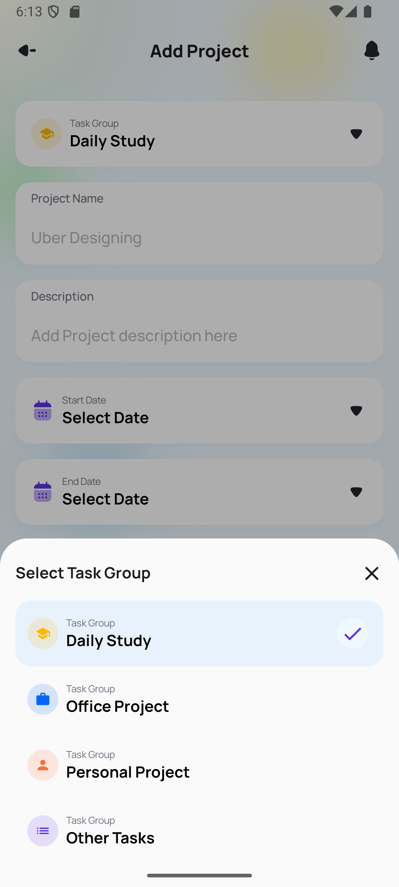
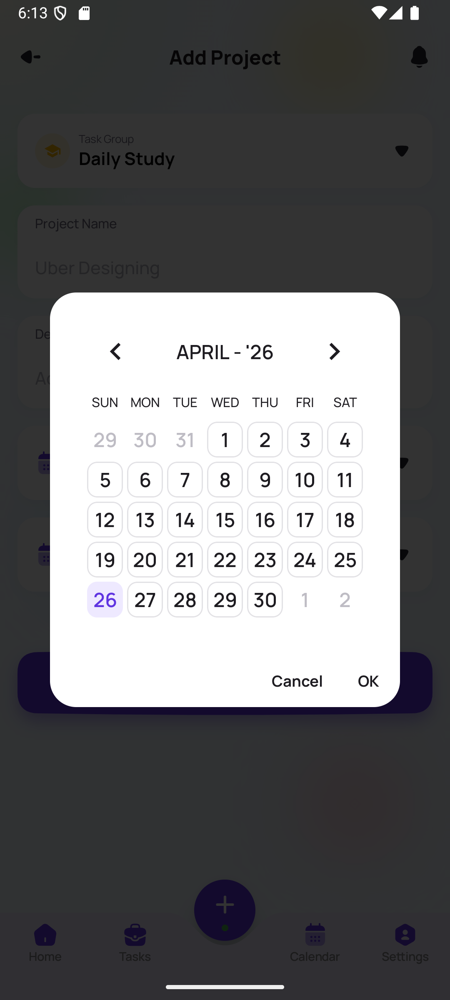
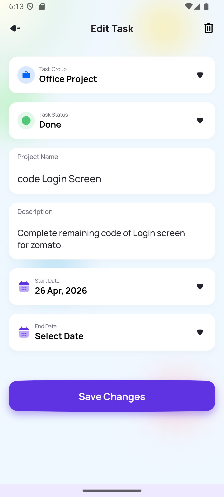

# 🚀 CMP Todo — Cross-Platform Todo App

A modern Todo application built using **Kotlin and Jetpack Compose Multiplatform**, supporting both **Android and iOS**. This project focuses on delivering a **high-quality UI/UX experience** while following **Clean Architecture principles** and scalable development practices.

---

## ✨ Features

- Add, update, and delete tasks
- Track task completion status
- Filter tasks by selected date
- Custom animated calendar view
- Categorized task management
- Most-used categories visualization (dynamic UI)
- User profile management
- Onboarding flow for first-time users
- Settings section with feedback and app info

---

## 📱 App Flow

### Onboarding
- Introductory screens for new users

### Home Screen (Custom Bottom Navigation)

Includes the following sections:

#### 🏠 Home
- Displays today's task progress
- Tasks grouped by categories

#### 📅 Tasks
- Custom animated calendar
- Select any date to view that day’s tasks

#### ➕ Add Task
- Create tasks with:
    - Title
    - Description
    - Category
    - Start & end date

#### 🔵 Categories
- Displays most-used categories
- Interactive sphere-style animated UI

#### ⚙️ Settings
- View and update user profile
- Shows total number of tasks
- Sections: About, Feedback, Report Bug

---

## 🏗️ Tech Stack

- **Language:** Kotlin
- **UI:** Jetpack Compose + Compose Multiplatform
- **Architecture:** Clean Architecture
- **Dependency Injection:** Koin
- **Database:** Room DB
- **Platforms:** Android & iOS

---

## 🧱 Architecture

The project follows Clean Architecture:

### Presentation Layer
- Screens
- ViewModels
- Navigation
- Components

### Domain Layer
- Repository

### Data Layer
- Repository Implementation
- Room Database

This structure ensures better scalability, testability, and maintainability.

---

## 🎯 Purpose

This project showcases:

- Cross-platform development using Compose Multiplatform
- Advanced UI design and animations
- Structured and scalable architecture
- Real-world app development approach

---

## 📸 Screenshots

<p align="start">
  
  
  
  
  
  
  
  
</p>

---

## 🛠️ Setup

```bash
git clone https://github.com/shivam1814/Todo-List-CMP.git
Open in Android Studio
Build and run on Android or iOS